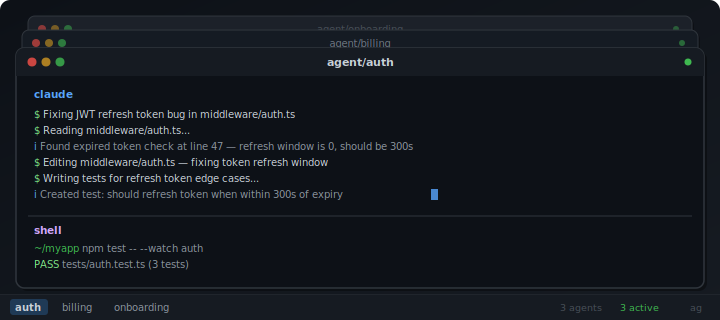

# 🛠️ ag.sh

<p align="center">
  
</p>

Command-line ADE tooling to run multiple Claude Code/AI agents in parallel - each in its own isolated git worktree.

Spawn, manage, and orchestrate AI-powered development across concurrent tasks without stepping on your own changes.

One command gives you everything: a git worktree, a branch, and a tmux window with the agent and shell running in the same window. Spawn as many as you need. Detach, come back tomorrow, and everything is still there.

- **Isolated** - Every task runs in its own branch and worktree. Agents can't collide or overwrite each other.
- **Persistent** - tmux keeps agents alive when you close your terminal. Worktrees survive reboots. `ag resume` rebuilds everything from disk. If a tmux session dies, `ag` attempts to resume conversations for `claude` and `codex`.
- **Stateless** - Git worktrees _are_ the state. No databases, no config files, no daemon. If tmux disappears, your work is still intact.
- **Combined API** - One CLI tool - `ag spawn`, `ag kill`, `ag open`, `ag rm`, `ag ls`. Nothing more.

```bash
# Get started with...
ag spawn auth --prompt "Fix the JWT refresh token bug"
ag spawn billing onboarding
```

That's three agents, three isolated checkouts, three tmux windows. Switch between them, zoom in, detach, resume.

## Requirements

- **bash** 4+ or **zsh** 5+
- **git** 2.15+ (worktree support)
- **tmux** 3.3a+ (pane title support)
- An agent CLI ([Claude Code](https://docs.anthropic.com/en/docs/claude-code), or any command)

## Installation

1. Download `ag.sh` to somewhere permanent:

```bash
curl -o ~/.ag.sh https://raw.githubusercontent.com/andrewhathaway/ag.sh/refs/heads/main/ag.sh
```

2. Source it in your shell config:

```bash
# ~/.bashrc or ~/.zshrc
source ~/.ag.sh
```

3. Restart your shell or `source ~/.bashrc`.

4. `cd` into any git repo and run `ag help`.

## Commands

| Command | Description |
|---|---|
| `ag` | Show agent status (same as `ag ls`) |
| `ag spawn <task> [--prompt "..."]` | Create worktree + branch, run optional prepare hook, then start the agent in tmux |
| `ag spawn <t1> <t2> <t3>` | Spawn multiple agents at once |
| `ag kill <task> [-f]` | Kill tmux window, keep worktree + branch (pause) |
| `ag rm <task> [-f]` | Kill window + remove worktree + delete branch (full cleanup) |
| `ag ls` | List all agents with colored status |
| `ag cd <task>` | `cd` into a task's worktree in your current shell |
| `ag open <task>` | Open a task's worktree in your IDE (`AGENT_IDE`) |
| `ag push <task>` | Push task branch to origin (before creating a PR) |
| `ag diff <task> [--stat]` | Show diff of task branch vs base branch |
| `ag attach` | Attach to this repo's tmux session |
| `ag resume [task ...]` | Respawn tmux windows for worktrees that lost their windows |
| `ag shell <task>` | Open a shell-only tmux window in a worktree (no agent) |
| `ag layout [h\|v\|even-h\|even-v]` | Change the pane split in the current window |
| `ag help` | Show command reference |

Both `ag kill` and `ag rm` support multiple tasks (`ag rm auth billing -f`) and require confirmation unless `--force` / `-f` is passed.

## Configuration

Set these environment variables before sourcing `ag.sh`:

| Variable | Default | Description |
|---|---|---|
| `AGENT_CLI` | `claude` | The command to run in each agent pane |
| `AGENT_WORKTREE_PARENT` | _(auto)_ | Override where worktrees are stored |
| `AGENT_BRANCH_PREFIX` | `agent` | Branch namespace (`agent/auth`, `agent/billing`). Set to an empty string for no prefix |
| `AGENT_DEFAULT_LAYOUT` | `main-horizontal` | Default layout used by `ag layout` |
| `AGENT_IDE` | `code` | IDE command for `ag open` (e.g. `cursor`, `zed`, `windsurf`, `idea`) |
| `AGENT_IGNORE_BRANCHES` | `main master develop` | Branches to exclude from `ag ls` when prefix is empty |
| `AGENT_SHELL_HEIGHT_PERCENT` | `30` | Percent of the task window height used for bottom shell panes during spawn |
| `AGENT_SHELL_PANES` | `1` | Number of shell panes to create side-by-side below the agent pane |

### Examples

```bash
# Use Claude with permissions skipped (for sandboxed environments)
export AGENT_CLI="claude --dangerously-skip-permissions"

# Store all worktrees in a central location
export AGENT_WORKTREE_PARENT="$HOME/worktrees"

# No branch prefix (branches named directly: auth, billing)
export AGENT_BRANCH_PREFIX=""

# Exclude additional branches from ag ls when using no prefix
export AGENT_IGNORE_BRANCHES="main master develop trunk release"

# Use a 70/30 agent/shell split with two shell panes underneath
export AGENT_SHELL_HEIGHT_PERCENT=30
export AGENT_SHELL_PANES=2
```

## Prepare Worktree Hook

Prepare a worktree for development (install deps, build) by commiting a `.agrc` script in the root of each repository you're working on. This file must executable, and will run when `ag` spawns a worktree for a new task.

```bash
#!/usr/bin/env bash
set -euo pipefail

npm install
npm run build
```

Create a `.agrc` file and make it executable using `chmod +x .agrc`. Variables `AG_TASK` (the task name) and `AG_WORKTREE` (the task worktree path) are available to the script when executed as part of the spawning of a new task.

## Tab completion

Tab completion is registered automatically for both bash and zsh:

- `ag <tab>` -- completes subcommands
- `ag kill <tab>` -- completes task names from existing worktrees
- `ag layout <tab>` -- completes layout options
- Works for: `kill`, `rm`, `cd`, `open`, `push`, `diff`, `shell`, `resume`

## Workflow

### Start a session

```bash
cd ~/projects/myapp

# Spawn an agent with an initial prompt
ag spawn auth --prompt "Fix the JWT refresh token expiry bug in middleware/auth.ts"

# Spawn another
ag spawn billing

# Check what's running
ag
```

```
  myapp  (2 agents, 2 active)

  TASK           STATUS         BRANCH                   WORKTREE
  auth           ● active       agent/auth               ../myapp-worktrees/auth
  billing        ● active       agent/billing            ../myapp-worktrees/billing
```

### Come back later

```bash
cd ~/projects/myapp
ag resume    # rebuilds tmux windows from worktrees on disk
```

Or if the session is still alive:

```bash
ag attach
```

### Review and ship

```bash
# See what the agent changed
ag diff auth --stat

# Push the branch
ag push auth

# Create a PR (your usual flow)
gh pr create ...

# Clean up after merge
ag rm auth -f
```

### Pause and resume

```bash
# Stop the agent but keep the worktree
ag kill auth

# Later, bring it back
ag resume auth
```

## Architecture

The design is deliberately stateless. There are no databases, lock files, PID files, or config directories. Two existing systems provide the durable state:

- **Git worktrees** are the durable source of truth. They survive tmux crashes, reboots, and terminal closures. `ag ls` and `ag resume` discover agents by parsing `git worktree list --porcelain`.
- **tmux** is the ephemeral UI layer. It can be destroyed and rebuilt at any time from the worktrees on disk. Pane titles (`agent:<task>`, `shell:<task>`, `shell:<task>:2`) are used to track which pane belongs to which task.

This means recovery is always possible: if tmux dies, `ag resume` scans for worktrees and recreates windows. If a worktree is manually deleted, `git worktree prune` cleans up and `ag ls` adapts.

## Compatibility

- **bash 4+** and **zsh 5+** -- tested in both. A runtime check warns and exits early if sourced in bash 3.x (the macOS system default). Install a newer bash via `brew install bash` or use zsh.
- **macOS** and **Linux** -- uses POSIX utilities plus git and tmux. No platform-specific dependencies.
- **Any agent CLI** -- defaults to `claude` but works with any command via `AGENT_CLI`. The agent runs in a tmux pane; `ag.sh` doesn't care what the command is.

## Contributing

See [CONTRIBUTING](./CONTRIBUTING.md) for the contributing guide/information.

## License

Copyright (c) 2026 Andrew Hathaway. Licensed under MIT license, see [LICENSE](./LICENSE) for the full license.

## Contact

You can find me on my [website](https://andrewhathaway.net), [Mastodon](https://mastodon.social/@andrewhathaway), and [Bluesky](https://bsky.app/profile/andrewhathaway.bsky.social).
